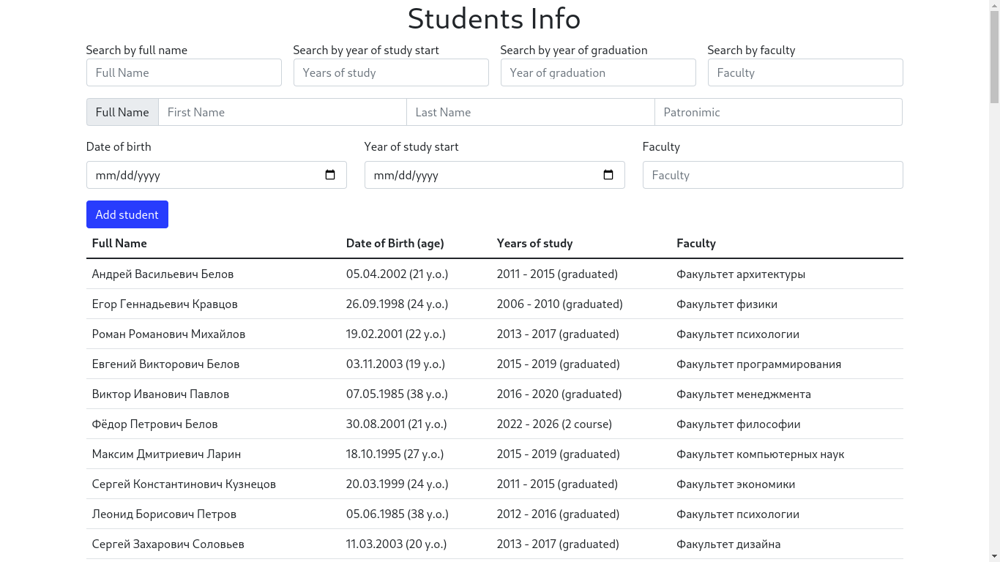

# StudentsInfo

## Table of contents

- [StudentsInfo](#studentsinfo)
  - [Introduction](#introduction)
  - [Features](#features)
  - [Table of contents](#table-of-contents)
  - [Technologies](#technologies)
  - [Setup](#setup)
    - [TODO](#todo)
  - [Project status](#project-status)
  - [Contacts](#contacts)

# Introduction

This project demonstrates how to create a dynamic table using JavaScript DOM manipulation, a RESTful API with Express, and data from a Postgres database. The application retrieves student information from the database and displays it in a table.

## Features

- Dynamic table creation using JavaScript and the DOM
- Data retrieved from a Postgres database using a REST API
- Easy-to-understand code structure
- Modifiable and customizable

## Technologies

Project is created with:

- JavaScript ES6
- [NodeJS](https://nodejs.org/en)
- My own written REST API
- [PostgreSQL](https://www.postgresql.org/)
- [Docker](https://www.docker.com/)
- [docker-compose](https://docs.docker.com/compose/)
- [Bootstrap](https://getbootstrap.com/)

## Setup

To run this project, first you need to clone repository:

`git clone git@github.com:sashauly/StudentsInfo.git`

Then run Docker containers with NodeJS REST API and postgres database:

`cd data-tables-JS-REST-Postgres/src/api && docker-compose up && cd ../`

Then you need to open up an html file in your browser:

For Linux: `xdg-open index.html`

For Mac: `open index.html`

### TODO

- Delete the user
- Update user info
- Create modal window for adding and searching
- Give up on Bootstrap in favor of pure CSS

## Project status

Project is: _in progress_

## Contacts

Created by [@sashauly](https://t.me/sashauly) - feel free to contact me!
